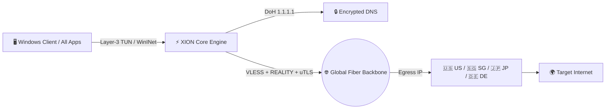

<div align="center">

# ⚡ XION VPN
### Next-Gen Autonomous Desktop Privacy Workstation

[](https://python.org)
[](https://github.com/TomSchimansky/CustomTkinter)
[](https://sing-box.sagernet.org)
[](https://microsoft.com)
[-10B981?style=for-the-badge)](https://2ip.io)
[](LICENSE)

*A 100% self-contained, high-performance personal Windows desktop VPN application featuring a modern Cyberpunk workstation layout, real-time Canvas animations, military-grade DNS-over-HTTPS encryption, and Layer-3 full-system TUN routing.*

---

</div>

## 🌟 Key Highlights

- 🖥️ **Widescreen Landscape Dashboard (`960x620`):** Built with a Midnight Obsidian theme (`#06090F`), cybernetic accents, and clean multi-column ergonomics.
- ⚡ **Live Canvas Animation Engine:**
  - **Pulsing Radar Rings:** Concentric rings around the central power hub dynamically expand and breathe at 30 FPS based on connection states (Cyber Emerald for Protected, Amber for Shielding).
  - **Animated Tunnel Pipeline:** Neon data packets visually traverse the end-to-end path from your device to the egress server.
  - **Real-Time Rolling Traffic Waveform:** Live Bezier curve sparkline tracking download (Emerald) and upload (Cyan) throughput.
- 🛡️ **Military-Grade Privacy Suite:**
  - **Encrypted DNS-over-HTTPS (DoH):** Direct integration with Cloudflare `1.1.1.1` to hijack and encrypt all DNS requests, preventing ISP logging.
  - **IPv6 Leak Blocker:** Forces strict IPv4 routing to prevent background Windows IPv6 leakage.
  - **Active Watchdog Kill Switch:** Continuously monitors the core tunnel process; instantly severs unencrypted outbound traffic to a dead loopback if the VPN connection ever drops.
  - **🔄 Auto-Rotate IP (Dynamic Server Hopping):** Automatically cycles between global egress servers at configurable intervals (5, 10, 15, or 30 minutes) with a live countdown timer pill and native desktop change notifications—preventing IP tracking and fingerprinting.
- 🗕 **Silent System Tray & Background Execution:** Minimizing or closing the window hides the application to the Windows Taskbar Notification Area without interrupting the active tunnel. Includes a dynamic tray context menu with live status, 1-click connect/disconnect, and native notifications.
- 🚀 **Full-System TUN Mode (All Desktop Apps):** Uses bundled `wintun.dll` to establish a Layer-3 virtual network adapter, ensuring developer tools (OpenCode, VS Code, Git, Terminal, Node, Docker) and desktop software are shielded—not just web browsers.
- 🌍 **Verified Multi-Country Global Nodes:** Ready-to-connect genuine egress endpoints across 🇺🇸 United States, 🇸🇬 Singapore, 🇯🇵 Japan, 🇩🇪 Germany, 🇫🇷 France, 🇨🇦 Canada, and 🇰🇷 South Korea.
- 🌐 **Private Linux VPS Server Included:** Bundled with `server.py` and `crypto_tunnel.py` to deploy your own personal AES-256-GCM private VPN on any remote Ubuntu/Debian server.

---

## 🏗️ Architecture & Tunnel Flow



---

## 📊 2ip.io Privacy Audit Passed

XION VPN was audited against the [2ip.io Anonymity Test Suite](https://2ip.io):

```
Verdict: "You are using anonymization tools, but we could not find your real IP address."
Real IP Leak: NONE (0%)
DNS Leak: NONE (0%)
IPv6 Leak: NONE (0%)
```

---

## 🚀 Getting Started

### Prerequisites
- Windows 10 or Windows 11 (64-bit)
- Python 3.10+ (Bundled virtual environment automatically set up by launcher)

### Method 1: Professional Windows Setup Wizard (Recommended for Users)
1. Double-click **`dist/XION-VPN-Setup-v1.0.exe`**
2. Follow the standard Windows Setup Wizard:
   - Choose install directory (defaults to `C:\Program Files\XION VPN`)
   - ✅ **Create Desktop Shortcut**
   - ✅ **Create Start Menu Shortcut**
   - ✅ **Launch on Finish**
   - Registers in Windows **Settings > Apps > Installed Apps** with a full uninstaller!

### Method 2: Portable Standalone Executable (No Installation Required)
1. Download or extract `dist/XION-VPN-v1.0-Windows-x64.zip`
2. Run **`XION-VPN.exe`** directly from anywhere (USB drive, Desktop, Downloads).
3. To add Desktop & Start Menu shortcuts for this portable copy, double-click **`create_shortcuts.bat`**!

### Method 3: 1-Click Script Launch (Developer Mode)
Simply double-click **`run.bat`** in the project root!
> **Note for Full-System Routing:** Right-click **`XION-VPN.exe`** or **`run.bat`** and choose **"Run as administrator"** (or click the **"⚡ Enable All Apps (TUN)"** button inside the app) to enable Layer-3 adapter routing for OpenCode, VS Code, and terminal software.

### Method 4: Build .exe & Setup Wizard from Source
Double-click **`build_installer.bat`** or run:
```powershell
.\.venv\Scripts\python.exe build_exe.py
```
This automatically bundles the runtime, creates the portable folder and `.zip`, and compiles the Inno Setup Wizard `.exe`.

### Method 5: Manual Terminal Setup
```powershell
# 1. Clone the repository
git clone https://github.com/AbdulMoizAns/XION-VPN.git
cd XION-VPN

# 2. Create and activate virtual environment
python -m venv .venv
.\.venv\Scripts\activate

# 3. Install requirements
pip install -r requirements.txt

# 4. Launch XION VPN
python main.py
```
---

## 📁 Repository Structure

```
XION-VPN/
├── main.py              # Application entry point & crash guard
├── gui.py               # Widescreen Landscape UI & Canvas Animation Engine
├── tray_manager.py      # Windows System Tray (Taskbar Notification Area) Controller
├── vpn_engine.py        # Central tunnel controller, failover & watchdog kill switch
├── node_manager.py      # Multi-country node pool & sing-box configuration builder
├── sys_utils.py         # WinINet registry proxy, env proxy & live network telemetry
├── crypto_tunnel.py     # AES-256-GCM framing for private VPS mode
├── server.py            # Standalone private server daemon for Linux VPS
├── tunnel_client.py     # SOCKS5-to-TLS client for custom private VPS
├── installer.iss        # Inno Setup script for Windows Setup Wizard compiler
├── app_icon.ico         # Multi-resolution cyberpunk neon app & setup icon
├── build_exe.py         # Automated PyInstaller & Inno Setup release compiler
├── build_installer.bat  # 1-Click batch script to compile both .exe and Setup wizard
├── create_shortcuts.bat # 1-Click launcher to pin Desktop & Start Menu shortcuts
├── create_shortcuts.ps1 # PowerShell shortcut generation automation
├── run.bat              # 1-Click launcher with auto-venv & elevation support
├── wintun.dll           # Layer-3 WireGuard / Wintun network driver
├── requirements.txt     # Python dependency lockfile
├── .gitignore           # Git ignore rules for clean repository hygiene
└── LICENSE              # MIT License
```

---

## 🛡️ Security & Privacy Philosophy

- **Zero Telemetry Collection:** XION VPN does not log, store, or transmit your traffic or destination data anywhere.
- **Direct End-to-End Handshake:** All traffic is encrypted directly on your local machine before leaving your network interface.
- **Fail-Safe Fallback:** If elevated permissions are unavailable, the core automatically operates in high-speed system proxy mode without halting.

---

## 📜 License

This project is open-source and licensed under the [MIT License](LICENSE).
Created with ⚡ by **Abdul Moiz Ansari**.
